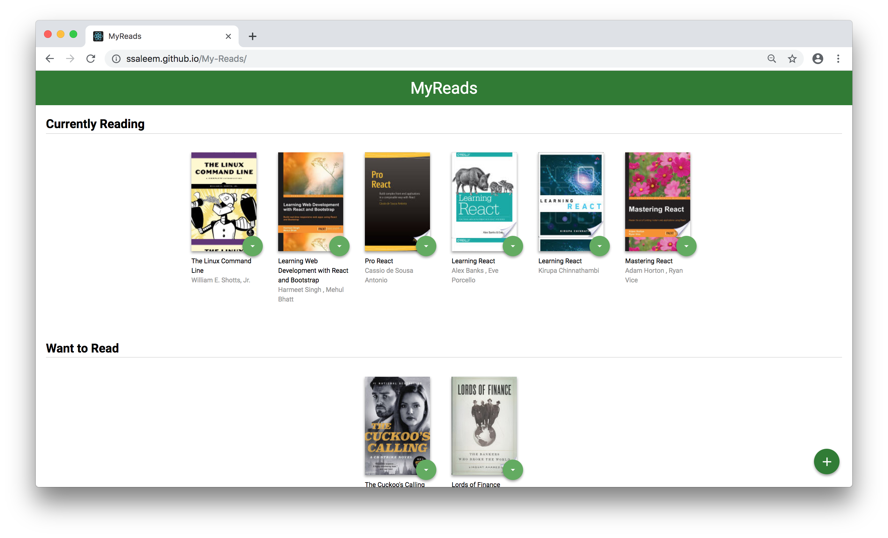

# My Reads

This project is a bookshelf app that allows the users to search and add books to their library. Witnin library, user can categorize the books under _Currently Reading_, _Want to Read_, and _Read_ sections. React is used to refactor static CSS and HTML markup from this [starter repository](https://github.com/udacity/reactnd-project-myreads-starter) and to make the application interactive.

## Built with

- [React](https://reactjs.org/) - A JavaScript library for building user interfaces.
- [react-router](https://reacttraining.com/react-router/)- A collection of navigational components that compose declaratively with React application.
- [prop-types](https://www.npmjs.com/package/prop-types) - Runtime type checking for React props.
- [Context API](https://reactjs.org/docs/context.html) - Context is designed to share data that can be considered “global” for a tree of React components and solves the problem of "prop drilling".

## Live Version

Project demo can be found [here](https://ssaleem.github.io/My-Reads).

## How to run locally

To test the project on your machine

- Click "Clone or download" / "Download ZIP".
- Install all project dependencies with `npm install`.
- Start the application server with `npm start`.

## About Search API

The backend search API uses a fixed set of cached search results and is limited to a particular set of search terms, which can be found in [SEARCH_TERMS.md](SEARCH_TERMS.md). That list of terms are the _only_ terms that will work with the backend.
